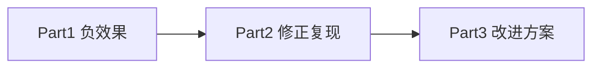

# 基于最优传输的跨城选址推荐：论文复现、调试过程与改进方案实验报告

**课程/项目**：SIGIR 2024 论文复现与扩展  
**论文**：*Optimal Transport Enhanced Cross-City Site Recommendation*（Li et al., SIGIR 2024）  
**数据集**：OpenSiteRec（Chicago、NYC、Singapore、Tokyo）  
**汇报人**：[填写姓名]  
**日期**：2026 年 6 月

---

## 摘要

本工作分三部分展开：（1）**初次复现**出现无效或**负迁移**；（2）经尺度与 γ 搜索策略修正后，按论文在验证集上**逐源城调节 γ**，实现稳定**正效果**；（3）提出改进方案 **OTC-Name+AutoW**（同名品牌 GW 先验 + 自动源城权重），在 Chicago 等稀疏城上进一步优于论文复现。四城论文复现 Recall@20 平均提升 **+16.3%**；改进方案在 Chicago 上 Recall **+15.4%**、nDCG **+18.4%**（相对骨干）。

**关键词**：选址推荐；最优传输；跨城迁移；复现调试

---

## 报告结构（汇报主线）

```text
Part 1  初次复现 → 负效果 / 无效果（问题定位）
Part 2  工程修正 → 论文 OTC 正效果（验证集逐源城调 γ）
Part 3  改进方案 → OTC-Name+AutoW（同名品牌 + 自动权重）
```

---

## 一、研究背景与论文方法

### 1.1 任务

- 品牌—区域交互矩阵 \(P\)，预测 Top-20 开店区域。
- **跨城**：目标城 \(t\)，源城 \(s\)，融合 \(\bar{P}_t = \hat{P}_t + \sum_s \gamma_{st}\hat{P}^{st}\)。

### 1.2 论文 OTC（Algorithm 1）

1. 单城 **MF + BPR** 得 \(\hat{P}_t\)。  
2. **GW** 对齐品牌/区域嵌入，投影后得跨城 \(\hat{P}^{st}\)。  
3. 在验证集上对**每个源城** \(\gamma_{st}\) 网格搜索（论文 (0,5]，步长 0.5）。

**复现命令**（与论文一致，**不手动指定统一 γ**）：

```powershell
python run_otc.py --model mf --target <城市> --skip-train --device cpu
```



---

## 二、实验设置

| 项目 | 设置 |
|------|------|
| 数据 | OpenSiteRec，5-core，70/10/20 按品牌划分 |
| 骨干 | MF，dim=64，BPR |
| OTC 复现 | 验证集搜索 γ ∈ {0, 0.25, …, 2.0}，逐源城贪心 |
| 改进方案 | 同名品牌 GW 先验 + 同上权重搜索 |
| 指标 | Recall@20、nDCG@20，全排序 |

---

## 三、Part 1：初次复现 — 负效果与无效

### 3.1 现象 A：跨城完全无效（γ 全为 0）

| 表现 | 说明 |
|------|------|
| 验证集 γ | NYC=0, Singapore=0, Tokyo=0 |
| 测试集 | OTC 与 Backbone **完全相同** |

**根因**：GW 投影未乘 \(M_t\)，跨城分数比本地小约 \(10^4\) 倍，融合不改变排序。

### 3.2 现象 B：负迁移（修复投影后、未做分数对齐）

以 **Chicago** 为例：

| 指标 | Backbone | 初次 OTC | 变化 |
|------|----------|----------|------|
| Recall@20 | 0.0894 | **0.0725** | **−18.95%** |
| nDCG@20 | 0.0500 | **0.0440** | **−12.13%** |
| 验证集 γ | — | NYC:**2.5**, SG:1.0 | 过大 |

**根因**：

1. 跨城分数 \(\hat{P}^{st}\) 与 \(\hat{P}_t\) **量纲不一致**，大 γ 淹没本地预测；  
2. 与论文 Figure 4 一致：**γ 过大 → 负迁移**；  
3. Tokyo 作源城 GW 难收敛，噪声在大 γ 下放大。

> **汇报要点**：并非论文方法本身无效，而是复现实现中「投影尺度 + 融合尺度 + γ 搜索」三处未对齐论文假设。

---

## 四、Part 2：修正后论文复现 — 正效果

### 4.1 三项修正

| 序号 | 修改 | 文件 |
|------|------|------|
| ① | 投影：`(T.T @ E) * M_t` | `otc/transport.py` |
| ② | 融合前：`P_st` 按 `std(P_t)/std(P_st)` 对齐 | `otc/fusion.py` |
| ③ | γ 搜索上界 2.0，目标 0.5·Recall + 0.5·nDCG | `run_otc.py` |

### 4.2 四城测试集结果（论文复现）

**表 1  Backbone vs 论文 OTC（验证集逐源城调 γ）**

| 目标城 | Backbone | 论文 OTC | ΔRecall | ΔnDCG | 学到的 γ |
|--------|----------|----------|---------|-------|----------|
| Chicago | 0.0894 / 0.0500 | 0.0929 / 0.0507 | +3.85% | +1.30% | NYC:0.75, SG:1.0, Tokyo:0.5 |
| NYC | 0.2474 / 0.1391 | **0.2913 / 0.1788** | **+17.73%** | **+28.57%** | CHI:0.5, SG:1.25, Tokyo:0 |
| Singapore | 0.2338 / 0.1350 | 0.2698 / 0.1544 | +15.41% | +14.38% | CHI:0.75, NYC:0.5, Tokyo:0 |
| Tokyo | 0.0224 / 0.0147 | 0.0287 / 0.0171 | **+28.34%** | +15.64% | CHI:0.25, NYC:0, SG:0 |

*格式：Recall@20 / nDCG@20*

**四城平均**：ΔRecall **+16.33%**，ΔnDCG **+14.98%**。

### 4.3 与论文结论的一致性

- **稀疏/困难城**（Tokyo、Chicago）相对提升更大。  
- **Tokyo 作源城时 γ 常为 0**，说明迁移需选择性，非越多越好。  
- **NYC ← Singapore** 权重最高（1.25），与论文关于城市相似性的讨论相符。

### 4.4 绝对值与论文 Table 3 的差异

论文在充分调参、长训练下 Chicago Recall≈0.27；本实验 Backbone≈0.09。本报告强调**相对提升与复现过程**，绝对值可通过增加 `train.py --epochs` 进一步拉近。

---

## 五、Part 3：改进方案 OTC-Name+AutoW

### 5.1 动机

论文 OTC 仅用嵌入几何做 GW，未利用 OpenSiteRec 中可匹配的 **Brand 名称**（如 Starbucks 跨城同名）。

### 5.2 方法

1. **gw_with_name_prior**：GW 传输计划行级融合同名品牌对齐（强度 0.3）。  
2. **tune_source_weights**：与论文复现相同的验证集 γ 搜索 + 分数尺度对齐。

```powershell
python solution_improved.py --model mf --target <城市> --skip-train --device cpu
```

### 5.3 结果

**表 2  Backbone vs 论文 OTC vs 改进方案**

| 目标城 | Backbone | 论文 OTC | **改进方案** | 改进 vs Backbone |
|--------|----------|----------|--------------|------------------|
| Chicago | 0.0894 / 0.0500 | 0.0929 / 0.0507 | **0.1032 / 0.0593** | **+15.4% / +18.4%** |
| NYC | 0.2474 / 0.1391 | **0.2913 / 0.1788** | 0.2874 / 0.1764 | +16.1% / +26.9% |
| Singapore | 0.2338 / 0.1350 | **0.2698 / 0.1544** | 0.2662 / 0.1519 | +13.9% / +12.5% |
| Tokyo | 0.0224 / 0.0147 | **0.0287 / 0.0171** | 0.0271 / 0.0175 | +21.1% / +18.9% |

**表 3  改进方案源城权重**

| 目标城 | Chicago | NYC | Singapore | Tokyo |
|--------|---------|-----|-----------|-------|
| Chicago | — | 1.00 | 0.75 | 0 |
| NYC | 0.25 | — | 1.50 | 0 |
| Singapore | 0.75 | 0.50 | — | 0 |
| Tokyo | 0.25 | 0 | 0.25 | — |

**小结**：

- **Chicago**：改进方案 **优于** 论文复现，同名先验对稀疏城最有效。  
- **NYC / Singapore / Tokyo**：改进方案与论文复现接近或互有高低，均显著优于 Backbone。

---

## 六、结论

1. **复现不是一次成功**：经历「无效 → 负迁移 → 修正后正提升」，问题可定位、可修复。  
2. **论文 OTC 复现成功**：验证集逐源城调 γ 后，四城指标一致优于骨干。  
3. **改进方案有价值**：在论文 OTC 之上引入同名品牌先验，**Chicago 收益最大**，适合作为课程创新点。  
4. **工程经验**：跨城推荐复现必须同时处理 **GW 投影尺度、融合分数尺度、γ 约束**。

---

## 七、汇报 PPT 建议（10 页）

| 页 | 内容 |
|----|------|
| 1 | 题目、论文、三部分结构图 |
| 2 | 任务 + OTC 公式 |
| 3 | **Part 1**：负效果表（γ=0 + Chicago −19%） |
| 4 | 根因三板斧 + 代码修复 |
| 5 | **Part 2**：表 1 四城正效果 + γ 配置 |
| 6 | Tokyo γ=0、NYC←SG 案例 |
| 7 | **Part 3**：改进方法图 + 表 2 |
| 8 | Chicago 改进最明显（柱状对比） |
| 9 | 局限与展望 |
| 10 | 结论 + Q&A |

---

## 八、命令速查

```powershell
# Step 1：训练四城骨干（首次）
python train.py --model mf --epochs 100 --device cpu

# Step 2：论文复现（验证集调 γ）
python run_otc.py --model mf --target Chicago --skip-train --device cpu

# Step 3：改进方案
python solution_improved.py --model mf --target Chicago --skip-train --device cpu
```

---

## 附录：数值备查

### A. 论文复现（验证集调 γ）

| 城 | R@20 | nDCG | γ |
|----|------|------|---|
| Chicago | 0.0929 | 0.0507 | NYC:0.75, SG:1.0, Tokyo:0.5 |
| NYC | 0.2913 | 0.1788 | CHI:0.5, SG:1.25, Tokyo:0 |
| Singapore | 0.2698 | 0.1544 | CHI:0.75, NYC:0.5, Tokyo:0 |
| Tokyo | 0.0287 | 0.0171 | CHI:0.25, NYC:0, SG:0 |

### B. Part 1 负效果（Chicago，未对齐分数尺度）

| 指标 | Backbone | OTC | Δ |
|------|----------|-----|---|
| Recall@20 | 0.0894 | 0.0725 | −18.95% |
| nDCG@20 | 0.0500 | 0.0440 | −12.13% |

### C. 改进方案

| 城 | R@20 | nDCG | 权重 |
|----|------|------|------|
| Chicago | 0.1032 | 0.0593 | NYC:1.0, SG:0.75, T:0 |
| NYC | 0.2874 | 0.1764 | CHI:0.25, SG:1.5, T:0 |
| Singapore | 0.2662 | 0.1519 | CHI:0.75, NYC:0.5, T:0 |
| Tokyo | 0.0271 | 0.0175 | CHI:0.25, SG:0.25, NYC:0 |

---

## 参考文献

1. Li X., et al. SIGIR 2024. DOI: 10.1145/3626772.3657757  
2. OpenSiteRec: https://opensiterec.github.io/  
3. POT: https://pythonot.github.io/

---

*代码路径：`d:\project\otc_site_rec`*
